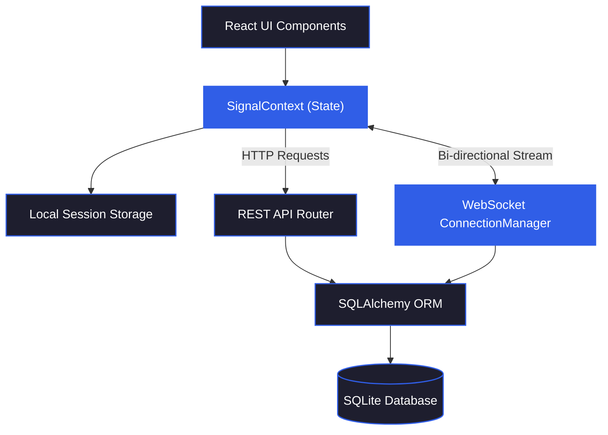

# Signal Messenger Clone (Fullstack Web Application)

A functional fullstack clone of the Signal messaging application designed to replicate Signal’s user experience, visual design, and core real-time messaging workflows[cite: 4]. Built with Next.js (TypeScript), FastAPI (Python), SQLite, and WebSockets.

---

## 🚀 Live Demo & Deployment

* **Live Web Application (Vercel):** [[https://signal-clone-4ef4mxc4j-sahil-0abf.vercel.app](https://signal-clone-steel-five.vercel.app))
* **Backend API Documentation (Render / Swagger):** [https://signal-clone-jy4h.onrender.com/docs](https://signal-clone-jy4h.onrender.com/docs)
* **Public GitHub Repository:** [https://github.com/Sahil-Tamrakar/signal-clone](https://github.com/Sahil-Tamrakar/signal-clone)

---

## 🛠️ Tech Stack

### **Frontend**
* **Framework:** Next.js 14+ (App Router, TypeScript)
* **Styling:** Tailwind CSS, Lucide React Icons
* **State Management:** React Context API (`SignalContext`)
* **Real-time Networking:** Native WebSockets API
* **Deployment:** Vercel

### **Backend**
* **Framework:** FastAPI (Python 3.10+)
* **Database & ORM:** SQLite, SQLAlchemy
* **Real-time Engine:** WebSockets (`ConnectionManager`)
* **Data Validation:** Pydantic v2
* **Deployment:** Render

---

## ✨ Core Features & Functionality

1. **Authentication & Onboarding**
   * Phone number/username login with mocked OTP verification (`123456`)
   * Custom display name and avatar setup.
   * Session persistence via `localStorage` and REST session state.

2. **Contacts & Conversation List**
   * Sidebar displaying active 1-on-1 direct messages and group chats sorted by recent activity.
   * Real-time search filter for contacts and existing conversations.
   * Unread message counters and online status badges.

3. **Real-Time One-on-One Messaging**
   * Instant bidirectional text messaging via WebSockets.
   * Delivery receipts (`✓` sent, `✓✓` delivered/read)[cite: 4].
   * Automatic message read status updates (`PUT /messages/read/...`).
   * Complete message history persistence in SQLite[cite: 4].

4. **Group Conversations & Admin Management**[cite: 4]
   * Create multi-user group chats with custom group titles[cite: 4].
   * Group Info modal to view active members[cite: 4].
   * Admin privileges allowing admins to add or remove members from group chats[cite: 4].

5. **Signal User Experience**[cite: 4]
   * Signal visual branding (color palette `#305EE7`, message bubble styles, typography)[cite: 4].
   * End-to-end encryption notice banners and privacy status placeholders[cite: 4].
   * Placeholder notices for Voice/Video calling and settings controls[cite: 4].

---

## 🏗️ Architecture Overview

The system architecture follows a decoupled Client-Server model communicating via REST APIs for initial data fetching/persistence and WebSockets for real-time updates[cite: 4]:



---

## 💾 Database Schema

The database relies on four core relational tables managed via SQLAlchemy:

```sql
-- Users Table
CREATE TABLE users (
    id INTEGER PRIMARY KEY AUTOINCREMENT,
    phone_number VARCHAR UNIQUE NOT NULL,
    username VARCHAR UNIQUE NOT NULL,
    display_name VARCHAR NOT NULL,
    status_text VARCHAR,
    is_online BOOLEAN DEFAULT FALSE,
    created_at TIMESTAMP DEFAULT CURRENT_TIMESTAMP
);

-- Conversations Table (Supports both Direct and Group messaging)
CREATE TABLE conversations (
    id INTEGER PRIMARY KEY AUTOINCREMENT,
    is_group BOOLEAN DEFAULT FALSE,
    title VARCHAR,
    avatar_url VARCHAR,
    updated_at TIMESTAMP DEFAULT CURRENT_TIMESTAMP
);

-- Conversation Members (Junction table linking Users <-> Conversations)
CREATE TABLE conversation_members (
    id INTEGER PRIMARY KEY AUTOINCREMENT,
    conversation_id INTEGER FOREIGN KEY REFERENCES conversations(id),
    user_id INTEGER FOREIGN KEY REFERENCES users(id),
    is_admin BOOLEAN DEFAULT FALSE,
    joined_at TIMESTAMP DEFAULT CURRENT_TIMESTAMP
);

-- Messages Table
CREATE TABLE messages (
    id INTEGER PRIMARY KEY AUTOINCREMENT,
    conversation_id INTEGER FOREIGN KEY REFERENCES conversations(id),
    sender_id INTEGER FOREIGN KEY REFERENCES users(id),
    content TEXT NOT NULL,
    status VARCHAR DEFAULT 'sent', -- sent, delivered, read
    created_at TIMESTAMP DEFAULT CURRENT_TIMESTAMP
);

```

---

## 🔌 API Reference Overview

### **Authentication**

* `POST /auth/login` — Verify phone/username & return user profile
* `POST /auth/register` — Create new user account

### **Contacts & Conversations**

* `GET /contacts` — Fetch available contacts
* `GET /conversations?user_id={id}` — Fetch active user conversations with unread counts
* `POST /conversations/direct` — Start or retrieve direct chat
* `POST /conversations/group` — Create a new group chat
* `GET /conversations/{id}/members` — Fetch group member list
* `POST /conversations/{id}/members` — Add member to group (Admin only)
* `DELETE /conversations/{id}/members/{user_id}` — Remove member (Admin only)

### **Messages & Real-Time**

* `GET /messages/{conversation_id}` — Fetch chat message history
* `POST /messages/?sender_id={id}` — Send and persist new message
* `PUT /messages/read/{conversation_id}?user_id={id}` — Mark conversation messages as read
* `WS /ws/{user_id}` — Establish WebSocket stream for real-time push events

---

## 🧪 Testing Real-Time Messaging Across Dual Windows

To test and verify real-time WebSocket communication, delivery receipts, and group chats, follow these steps:

### **Available Pre-seeded Test Accounts**

| User | Phone Number | Username | Default OTP |
| --- | --- | --- | --- |
| **User 1 (Sahil)** | `+1234567890` | `@sahil` | `123456` |
| **User 2 (Harsh)** | `+1983627362` | `@harsh` | `123456` |
| **User 3 (Apoorv)** | `+1122334455` | `@apoorv` | `123456` |
| **User 4 (Shubh)** | `+1555666777` | `@shubh` | `123456` |

---

### **Step-by-Step Two-Window Verification Procedure**

#### **1. Setup Window A (Regular Window)**

* Navigate to the live web app: [https://signal-clone-4ef4mxc4j-sahil-0abf.vercel.app](https://signal-clone-4ef4mxc4j-sahil-0abf.vercel.app?utm_source=gemini)
* Sign in using **Sahil's Phone Number**: `+1234567890`
* Enter the OTP: `123456`

#### **2. Setup Window B (Incognito / Private Window)**

* Open a new **Incognito / Private Window** in your browser.
* Navigate to the same live web app: [https://signal-clone-4ef4mxc4j-sahil-0abf.vercel.app](https://signal-clone-4ef4mxc4j-sahil-0abf.vercel.app?utm_source=gemini)
* Sign in using **Harsh's Phone Number**: `+1983627362`
* Enter the OTP: `123456`

#### **3. Testing Real-Time Direct Messaging**

* Position both browser windows side by side.
* In **Window A (Sahil)**, select the **Harsh** chat from the sidebar.
* In **Window B (Harsh)**, select the **Sahil** chat from the sidebar.
* Type a message in Window A (e.g., *"Hey Harsh, testing WebSockets!"*) and press **Send**.
* **Result:** The message instantly appears in Window B without refreshing the page, and the checkmark status on Window A updates to read receipts (`✓✓`).

#### **4. Testing Group Messaging**

* In **Window A**, click the **New Chat** pencil icon $\rightarrow$ select **New Group**.
* Name the group (e.g., *"Dev Team"*) and select **Harsh** and **Shubh** as members.
* Send a message to the group from Window A.
* **Result:** The group conversation instantly appears in Window B's sidebar, and Harsh receives the group message in real time.

---

## 💻 Local Setup & Development Instructions

### **Prerequisites**

* Node.js (v18+)
* Python (v3.10+)
* Git

---

### **1. Clone the Repository**

```bash
git clone [https://github.com/Sahil-Tamrakar/signal-clone.git](https://github.com/Sahil-Tamrakar/signal-clone.git)
cd signal-clone

```

---

### **2. Setup Backend (FastAPI)**

```bash
# Navigate to backend directory
cd Backend

# Create a virtual environment
python -m venv .venv

# Activate virtual environment
# Windows:
.venv\Scripts\activate
# Mac/Linux:
source .venv/bin/activate

# Install dependencies
pip install -r requirements.txt

# Run FastAPI development server
uvicorn app.main:app --reload --port 8000

```

> **Note:** The backend API will be available at `http://127.0.0.1:8000` with interactive docs at `/docs`. Database tables and seed data auto-generate on startup.
> 
> 

---

### **3. Setup Frontend (Next.js)**

```bash
# Open a new terminal and navigate to frontend directory
cd Frontend

# Install packages
npm install

# Create environment variable file (.env.local)
echo "NEXT_PUBLIC_API_URL=[http://127.0.0.1:8000](http://127.0.0.1:8000)" > .env.local
echo "NEXT_PUBLIC_WS_URL=ws://127.0.0.1:8000" >> .env.local

# Start Next.js development server
npm run dev

```

Open [http://localhost:3000](http://localhost:3000?utm_source=gemini) in your browser to access the application.

---

## 📜 Assumptions & Notes

* **Cryptographic Key Exchange:** Real-time end-to-end cryptographic key generation is simulated/mocked.


* **Ephemeral File System Handling:** Render free-tier instances use an ephemeral filesystem. SQLite seeds automatically during app startup (`@app.on_event("startup")`) to ensure persistent usability across instance restarts.


```

```
